# Power-BI-project

## Data sources

- Orders table - Azure SQL Database
- dim_products table - Imported from csv
- dim_stores table - Azure blob storage
- dim_customers table - Imported and combined from csv files in a zip folder

## Table Transformations

**Orders table:**

- Removed \[card number\] column to protect customer privacy.
- Split datetime columns into separate date and time columns.
- Removed rows missing an \[order date\] value.


**dim_products table:**

- Removed duplicate \[product code\] entries.
- Cleaned the \[weight\] column by splitting numbers and units, replacing blanks and error values and converting all weights to kg using 
```
Weight (kg) = IF(Products[Units] <> "kg", Products[Weight]/1000, Products[Weight])
```

**dim_customers table:**

- Combined the \[First Name\] and \[Last Name\] columns together to create the \[Full Name\] column.
- Removed the \[source.name\] column.

**dim_stores table:***

- Replaced erroneous values in the \[Region\] column.
- Created new columns named \[Country\] and \[Geography\] using:
```
Country = SWITCH(dim_stores[Country Code], "GB", "United Kingdom", "DE", "Germany", "US", "United States")

Geography = dim_stores[Country Region] & ", " & dim_stores[Country]
```
- Created a geography hierarchy including \[Region\], \[Country\], \[Country Region\]

## Calculated tables

**Dates table:**

- Created a date table ranging from the start of the year of the first order to the end of the year of the last shipment using:
``` 
Date = CALENDAR(STARTOFYEAR(Orders[Order Date]), ENDOFYEAR(Orders[Shipping Date]))
```
- Created columns for time measures, using ```MONTH```, ```QUARTER```, ```YEAR```, ```STARTOFMONTH```, ```STARTOFQUARTER```, ```STARTOFYEAR``` and ```WEEKDAY```.
- Created a date hierarchy including \[Start of Year\], \[Start of Quarter\], \[Start of Month\], \[Start of Week\], \[Date\]

**Measures table:**

Created the following measures:

- ```Total Customers = DISTINCTCOUNT(Orders[User ID])```
- ```Total Orders = COUNT(Orders[Order Time])```
- ```Total Quantity = SUM(Orders[Product Quantity])```
- ```Total Profit = SUMX(Orders, Orders[Product Quantity] * (RELATED(Products[sale_price]) - RELATED(Products[cost_price])))```
- ```Total Revenue = SUMX(Orders, Orders[Product Quantity] * RELATED(Products[sale_price]))```


- ```Profit YTD = CALCULATE([Total Profit], Dates[Year] == YEAR(TODAY()))```
- ```Revenue YTD = CALCULATE([Total Revenue], Dates[Year] == YEAR(TODAY()))```

- ```Profit per Order = [Total Profit]/[Total Orders]```
- ```Revenue per Customer = [Total Revenue] / [Total Customers]```


- ```Product category selection = IF(ISFILTERED(Products[category]), CONCATENATEX(VALUES(Products[category]), Products[category], ", "), "All selected")```
- ```Country selection = IF(ISFILTERED(dim_stores[country]), CONCATENATEX(VALUES(dim_stores[country]), dim_stores[country], ", "), "All selected")```


- ```Previous Quarter Orders = CALCULATE([Total Orders], PREVIOUSQUARTER(Dates[Date]))```
- ```Previous Quarter Profit = CALCULATE([Total Profit], PREVIOUSQUARTER(Dates[Date]))```
- ```Previous Quarter Revenue = CALCULATE([Total Revenue], PREVIOUSQUARTER(Dates[Date]))```


- ```Current Quarter Orders = CALCULATE([Total Orders], DATESINPERIOD(Dates[Date], STARTOFQUARTER(Dates[Date]), 1, QUARTER))```
- ```Current Quarter Profits = CALCULATE([Total Profit], DATESINPERIOD(Dates[Date], STARTOFQUARTER(Dates[Date]), 1, QUARTER))```
- ```Current Quarter Revenue = CALCULATE([Total Revenue], DATESINPERIOD(Dates[Date], STARTOFQUARTER(Dates[Date]), 1, QUARTER))```


- ```5% Orders target = 1.05 * [Previous Quarter Orders]```
- ```5% Profit target = 1.05 * [Previous Quarter Profit]```
- ```5% Revenue target = 1.05 * [Previous Quarter Revenue]```


- ```10% Orders target = 1.1 * [Current Quarter Orders]```
- ```10% Profit target = 1.1 * [Current Quarter Profits]```
- ```10% Revenue target = 1.1 * [Current Quarter Revenue]```

- ```20% Profit target =
  VAR CurrentYearProfit = [Profit YTD]
  VAR PreviousYearProfit = CALCULATE([Profit YTD], DATEADD(Dates[Date], -1, YEAR))
  VAR TargetGrowth = 0.2
  RETURN
  IF(ISBLANK(PreviousYearProfit), BLANK(), PreviousYearProfit * (1 + TargetGrowth))```

- ```20% Revenue target =
  
  

## Database model

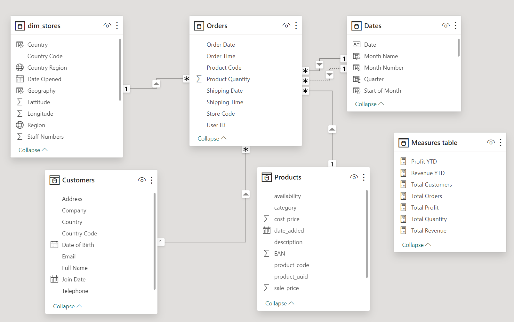

## Report pages

**Navigation bar**

The navigation bar provides page navigation buttons to move between the pages: 'Executive Summary', 'Customer Detail', 'Product Detail' and 'Stores Map'. The 'Product Detail' page also contains a filter button which uses bookmark states to bring a filter pane onto the screen to allow the user to filter the page by country and product category. The 'Stores Drillthrough' page which is accessed from the 'Stores Map' page also contains a back button to allow the user to return back to the 'Stores Map' page.

**Executive Summary**

- Headline card visuals highlighting total revenue, total profit and total customer orders.
- Donut charts breaking down revenue by country and store type.
- Line chart showing total revenue over a time hierarchy. Drill down capabilities through years, quarters and months.
- Bar chart of customer orders by product category.
- Key performance indicators for profit, revenue and customer orders over quarters. With a target of a 5% increase on the previous quarter.
- Table showing top 10 products by quantity sold.
- Interactions adjusted so that the bar chart and the table visuals do not filter the card visuals or KPIs.

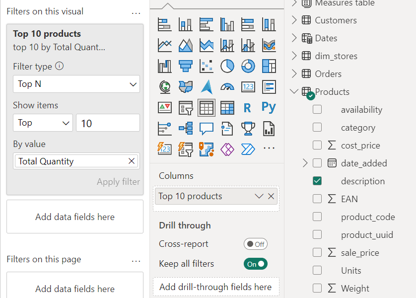
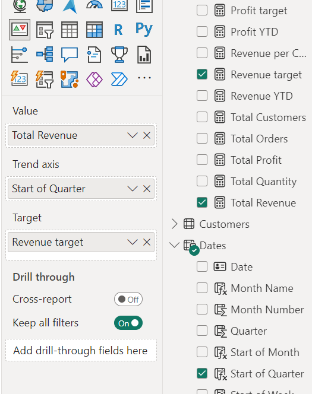 <br><br>


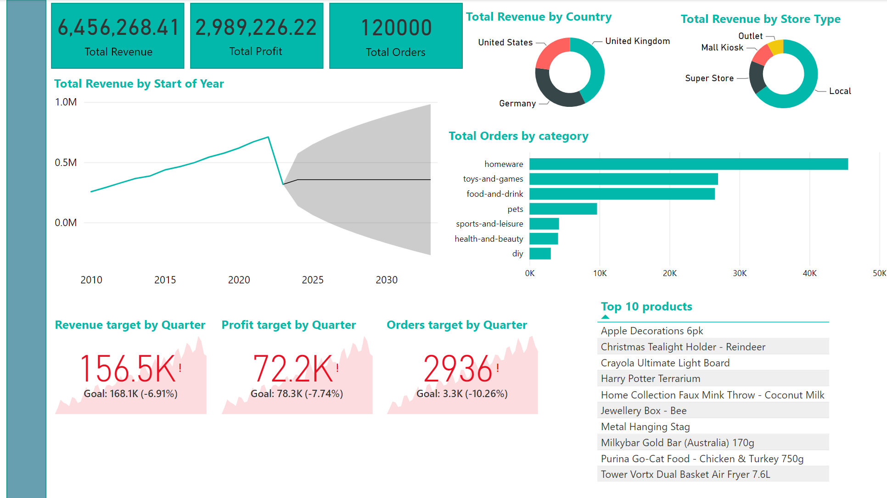

**Customer Detail**

- Headline card visuals highlighting the number of unique customers and the average revenue from each customer.
- Donut chart showing the proportions of sales in the United Kingdom, United States and Germany.
- Donut chart showing the numbers of customers purchasing within each product category.
- Line chart showing the number of customers on the y-axis against a time hierarchy on the x-axis. Drill down capabilities through years, quarters and months.
- 10 period forecast added to the line chart.
- Table of top 20 customers by revenue, showing full name, revenue and quantity of products ordered. Data bars added to revenue column.
- Set of three card visual showing the name, revenue and number of orders of the top customer by revenue.
- Data slicer allowing user to scroll through different years.
- Table visual does not filter other visuals.
- Product category donut chart does not filter the line chart.
- Product category donut chart cross filters with the country donut chart.

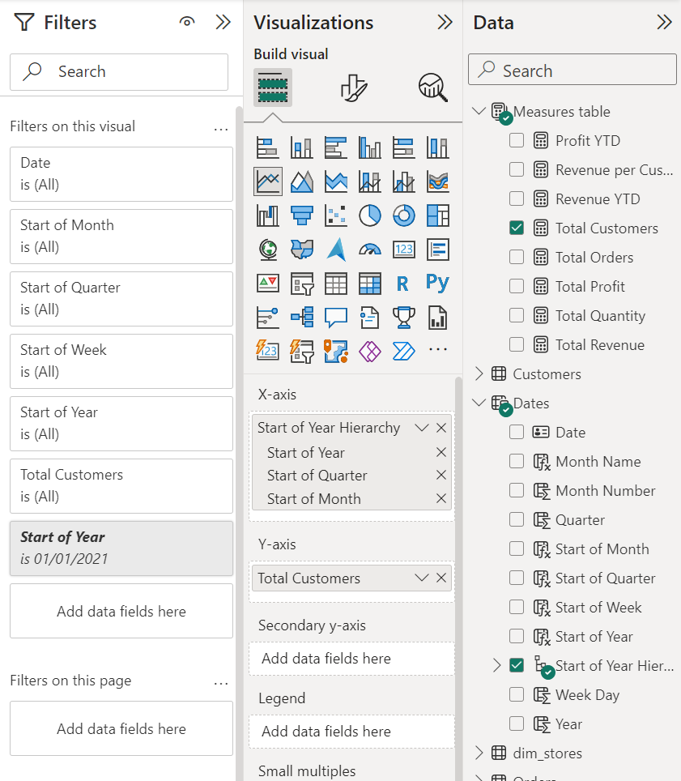
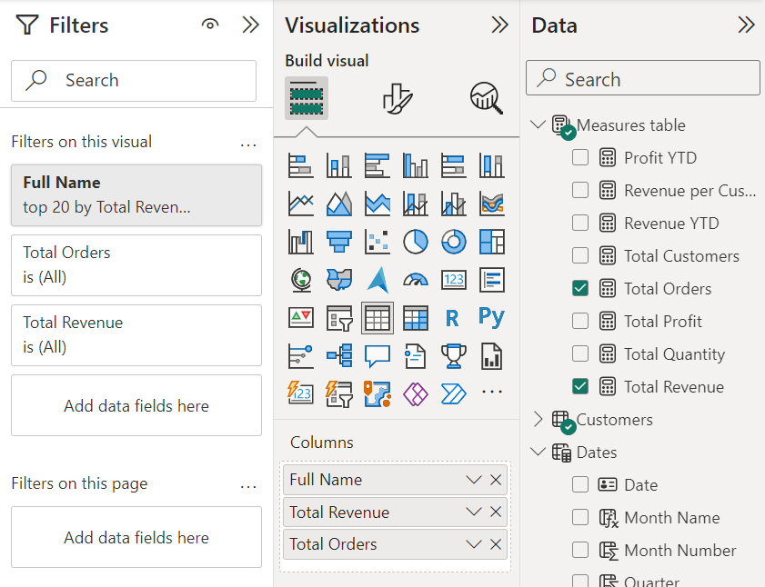 <br><br>


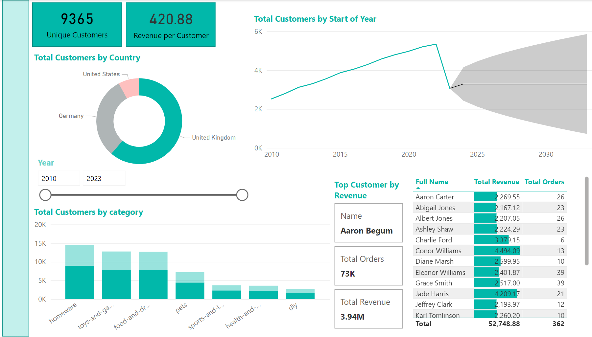

**Product Detail**

- Gauge visuals showing current quarter performance of customer orders, revenue and profit against a target of a 10% increase from the previous quarter.
- Area chart showing the revenue from the different categories of products over time.
- Table of top 10 products by revenue. Including product description, revenue, number of customers, number of orders and profit per order.
- Scatter graph of total quantity vs profit per item. Points are categorised by product category.
- Created a slicer panel containing slicers for filtering by product category and by country. The panel can be opened and closed by action buttons which operate using bookmarks.
- Added card visuals showing the current category and country filter selected from the slicer panel.
- The scatter graph and table do not filter any other visuals on the page.

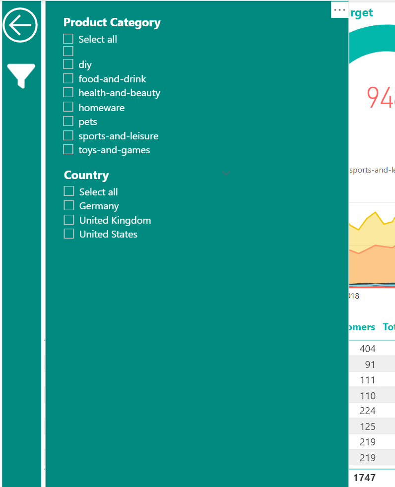 <br><br>

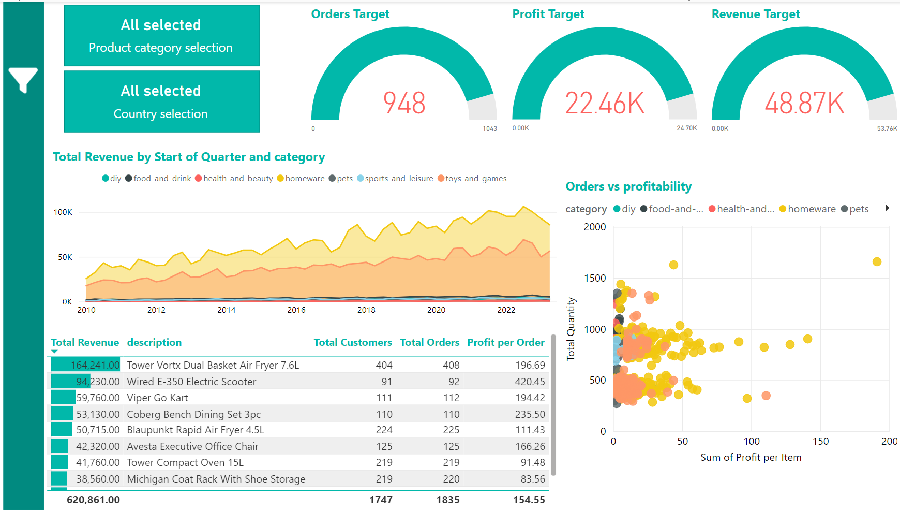


**Stores Map**

- Map visual showing locations of stores. Drill down capabiities through region, country, country region and store code. Year-to-date profit shown as a tooltip for each location.
- Slicer to filter by country. Select all option is enabled.
- Ability to drill through to the **Stores Drillthrough** page showing visuals for the selected country or country region.

**Stores Drillthrough**

- Table of top 5 products by revenue showing product description, year-to-date profit, total orders and total revenue.
- Column chart showing total orders by product category.
- Gauges for year-to-date profit and revenue against a target of a 20% year-on-year increase.
- Card visuals showing the currently selected store and country region the store is located in.

**Stores tooltip page**

- Gauge visual showing the year-to-date profit for a selected region, country or country region.

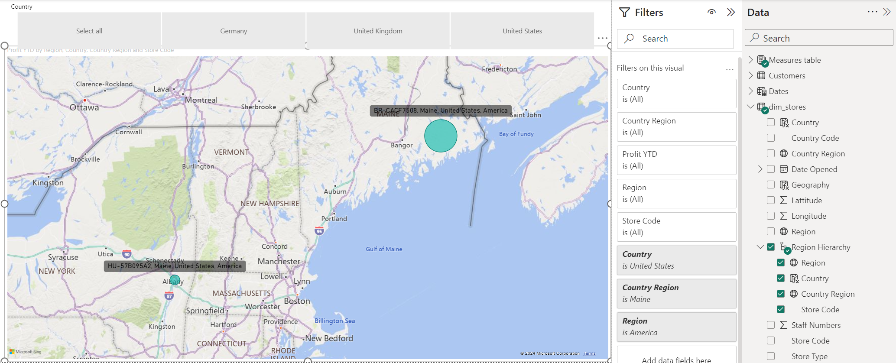 <br><br>
 <br><br>

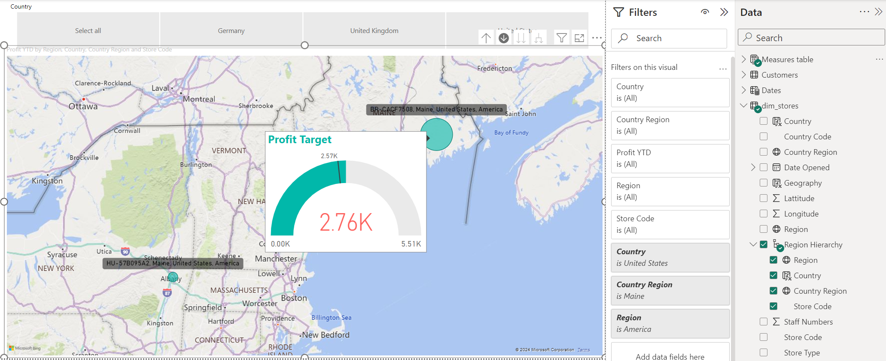
